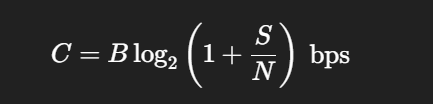

4️⃣ Shannon 定理說明
(1) 夏農信道編碼定理 (Shannon’s Noisy Channel Coding Theorem)
定理內容：對於任意的雜訊信道，只要傳輸速率 𝑅 R 小於信道容量 𝐶 C，存在編碼方式可以使錯誤率趨近 0。
意義：信號可用理論上無錯誤的方式傳輸，限制是速率不超過信道容量。
(2) 夏農–哈特利定理 (Shannon–Hartley Theorem)
定理內容：對於帶寬為 𝐵 B Hz、信號功率 𝑆 S 與噪聲功率 𝑁 N 的高斯信道，最大信道容量為：

意義：給出在實際物理信道中可達到的最大傳輸速率，與帶寬和信噪比直接相關。