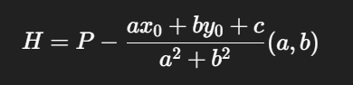

1️⃣ 點、線、圓為何這樣定義？
    點：(𝑥,𝑦) → Python 類別 Point
    直線： 𝑎 𝑥 + 𝑏 𝑦 + 𝑐 = 0 ax+by+c=0
    可直接計算距離、投影、交點
    圓： ( 𝑥 − ℎ ) 2 + ( 𝑦 − 𝑘 ) 2 = 𝑟 2 (x−h) 2 +(y−k) 2 =r 2
    這些都是「代數化的幾何描述」，適合計算。
2️⃣ 交點為何能用代數算？
    兩直線
    {a1​x+b1​y+c1​=0
    {a2​x+b2​y+c2​=0​
    行列式 𝐷 ≠ 0 D  =0 ⇒ 唯一交點
    行列式 𝐷 ≠ 0 D  =0 ⇒ 唯一交點
    ➡ 線性代數的解方程
    直線 × 圓
    一次式代入二次式
    得二次方程
    判別式 Δ：  
        Δ < 0：無交點
        Δ = 0：相切
        Δ > 0：兩交點
    ➡ 代數判定幾何關係
    圓 × 圓
        利用圓心距
        將問題轉為三角形分解
        用畢氏定理求交點高度
    ➡ 幾何 + 代數混合
3️⃣ 垂足為何能這樣算？
對直線 𝑎 𝑥 + 𝑏 𝑦 + 𝑐 = 0 ax+by+c=0
點到直線最短距離方向為法向量(a,b)
    
➡ 向量投影原理
4️⃣ 畢氏定理為何一定成立？
    PH⊥HA
    向量內積為 0
    歐氏距離平方：
    ∣PA∣ 2 =∣PH∣ 2 +∣HA∣ 2
➡ 正交向量 ⇒ 畢氏定理

5️⃣ 平移、縮放、旋轉是什麼？
| 變換 | 數學本質 | 幾何不變量 |
| -- | ---- | ----- |
| 平移 | 向量加法 | 距離、角度 |
| 縮放 | 純量乘法 | 角度    |
| 旋轉 | 正交矩陣 | 距離、角度 |
➡ 線性代數即幾何變換