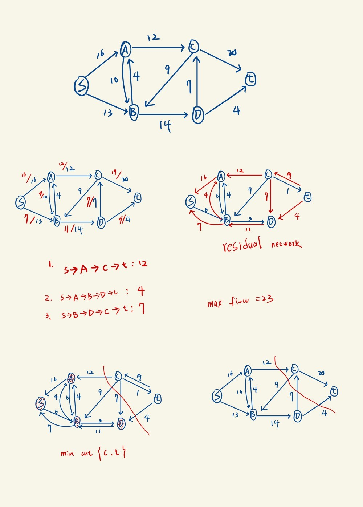

最近有在上離散跟演算法，想說做一下流量問題

我用的的是 FordFulkerson_method_DFS_maxflow 版本

(參考資料)[https://web.ntnu.edu.tw/~algo/Flow.html]，看講義但沒有抄

DFS

1.S->A->C->T:12

2.S->A->B->T:4

3.S->B->D->C->T:7

max_flow=23

下圖有 residual network 跟 min cut

